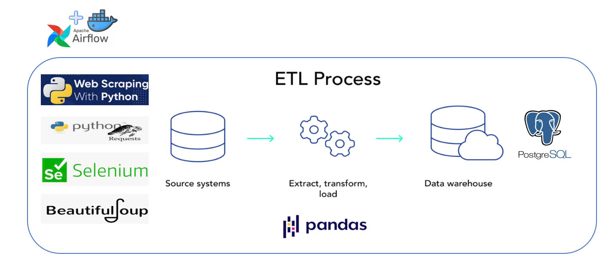
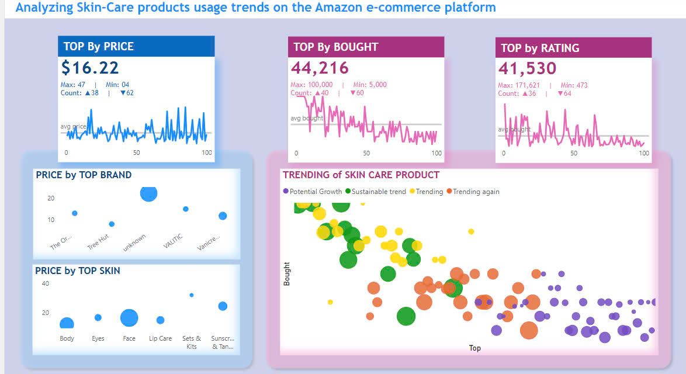
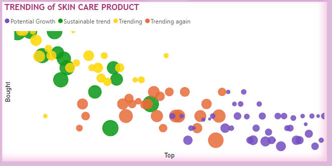

# Automated Analysis of Skin Care Product Usage Trends on Amazon Ecommerce

## Table of Contents
- [Project Overview](#project-overview)
- [Data Pipeline](#data-pipeline)
- [Web Scraping](#web-scraping)
- [Transform](#transform)
- [Clustering with K-Means](#clustering-with-k-means)
- [Data Warehouse](#data-warehouse)
- [Visualization with Power BI](#visualization-with-power-bi)
- [Automation with Docker and Airflow](#automation-with-docker-and-airflow)
- [Usage](#usage)
---

## Project Overview
This project, title **"Automated Analyzing Skin-Care Product Usage Trends on the Amazon E-commerce Platform"**, explores skincare product trends on Amazon by collecting, processing, and analyzing data from Amazon's bestseller lists. The main focus is to uncover insights into **customer purchasing behavior** and **product performance** through a robust data pipeline that integrates:
- Web scraping https://www.amazon.com/Best-Sellers-Beauty-Personal-Care-Skin-Care-Products/zgbs/beauty
- ETL (Extract, Transform, Load) processes
- Data warehousing
- K-Means clustering
- Visualization with Power BI

### Goals
The primary objective is to identify key trends in skincare product sales, such as:
- Sustainable practices (e.g., eco-friendly packaging)
- Emerging market trends (e.g., rise of natural ingredients)
- Potential business opportunities (e.g., underserved product categories)

---

## Data Pipeline

The data pipeline automates the flow from raw data collection to actionable insights, ensuring efficiency and scalability.

---

## Web Scraping
This section leverages web scraping techniques to gather data from Amazon's skincare product listings, including product names, prices, ratings, and purchase statistics.

### Tools Used
- **`Requests`**:
  - **Purpose**: Sends HTTP requests to fetch raw HTML data from Amazon product pages.
  - **Why**: It’s lightweight, fast, and ideal for static web content, reducing the need for heavy browser automation when possible.
- **`BeautifulSoup`**:
  - **Purpose**: Parses HTML content to extract structured data like product titles, ratings, and purchase counts.
  - **Why**: It provides a simple, Pythonic way to navigate and search HTML tags, making data extraction efficient and reliable.
- **`Selenium`**:
  - **Purpose**: Automates browser interactions to scrape dynamic content (e.g., JavaScript-loaded elements like "Load More" buttons).
  - **Why**: Essential for handling Amazon’s dynamic pages where content isn’t fully loaded in the initial HTML response.
---

## Transform
The **Transform** step processes raw data collected from web scraping into a clean, structured format suitable for analysis. It includes data cleaning, feature engineering, and predictive modeling to impute missing values, followed by clustering preparation.

### Data Preprocessing
- **Libraries Used**:
  - **`pandas`**: For data manipulation and cleaning.
  - **`numpy`**: For numerical operations.
- **Steps**:
  - Clean and convert columns:
    - `top`: Remove `#` and convert to integer.
    - `rating_count`: Remove commas and convert to integer.
    - `price`: Remove `$` and convert to float.
    - `bought_info`: Extract numeric value from "X K+" format (e.g., "10K+" → 10000), handle missing values later.
  - Fill missing `brand` values with `"unknown"`.

### Predictive Modeling for Missing Values
- **Libraries Used**:
  - **`sklearn`**: For `LabelEncoder`, `StandardScaler`, `RandomForestRegressor`, and model evaluation.
  - **`xgboost`**: For `XGBRegressor`.
- **Process**:
  1. **Encoding**: Convert categorical columns (`category`, `brand`, `skin_type`) to numeric using `LabelEncoder`.
  2. **Split Data**: Separate rows with known `bought_info` (training) and missing `bought_info` (prediction).
  3. **Scaling**: Apply `StandardScaler` to normalize features.
  4. **Model Training**:
     - **Random Forest**: Tune hyperparameters (`n_estimators`, `max_depth`, etc.) using `RandomizedSearchCV`.
     - **XGBoost**: Tune hyperparameters (`learning_rate`, `subsample`, etc.) similarly.
  5. **Evaluation**: Compare models using Mean Squared Error (MSE) and R² on validation data.
  6. **Prediction**: Use the best model (lowest MSE) to predict missing `bought_info` values.
- **Output**: A complete dataset with imputed `bought_info` saved as `processed.csv`.

---

## Clustering with K-Means
This section applies K-Means clustering to group skincare products based on purchase behavior and performance metrics, with feature engineering to enhance the process.

### Feature Engineering
- **Libraries Used**:
  - **`pandas`**: For data manipulation.
  - **`numpy`**: For numerical operations.
  - **`sklearn.preprocessing`**: For `StandardScaler`.
  - **`sklearn.decomposition`**: For `PCA`.
- **Steps**:
  1. **Select Features**: Use `bought_info`, `rating_count`, and `top` for clustering; drop irrelevant columns (`link`, `id`, `skin_type`, `brand`, `price`, `category`).
  2. **Scaling**: Normalize the data using `StandardScaler` to ensure equal feature weighting.
  3. **Dimensionality Reduction**: Apply `PCA` (2 components) to reduce the feature space while retaining variance.

### Clustering Process
- **Libraries Used**:
  - **`sklearn.cluster`**: For `KMeans`.
  - **`yellowbrick.cluster`**: For `KElbowVisualizer`.
  - **`matplotlib` & `seaborn`**: For visualization.
- **Steps**:
  1. **Optimal K Selection**: Use the elbow method (`KElbowVisualizer`) to determine the optimal number of clusters (`k`) within the range 2–10.
  2. **K-Means Clustering**: Apply `KMeans` with the selected `k` to assign cluster labels.
  3. **Visualization**: Plot clusters using a scatter plot of PCA components, colored by cluster labels.
- **Cluster Labeling**:
  - Compute mean `bought_info`, `rating_count`, and `top` for each cluster.
  - Define thresholds based on average `top` and `rating_count`.
  - Assign labels:
    - `Potential Growth`: High `top`, low `rating_count`, highest `bought_info` among potential clusters.
    - `Steady Seller`: High `top`, low `rating_count`, lower `bought_info`.
    - `Sustainable Trend`: Low `top`, high `rating_count`.
    - `Trending`: Low `top`, low `rating_count`.
    - `Trending Again`: High `top`, high `rating_count`.
- **Output**: Updated DataFrame with `cluster` and `cluster_label` columns, saved as `gold.csv`.

---

## Data Warehouse
The transformed data is loaded into a **PostgreSQL data warehouse** for structured storage, efficient querying, and downstream analysis.

### Setup
- **Tool**: PostgreSQL
- **Libraries Used**:
  - **`pandas`**: For reading and manipulating the CSV input.
  - **`psycopg2`**: For connecting to PostgreSQL and executing SQL commands.
  - **`dotenv`**: For securely loading environment variables (e.g., database credentials).
  - **`logging`**: For tracking the loading process and errors.
- **Schema**:
  - `id` (TEXT): Product identifier.
  - `top` (INTEGER): Ranking position.
  - `link` (TEXT): Product URL.
  - `rating_count` (INTEGER): Number of ratings.
  - `price` (DECIMAL): Product price.
  - `skin_type` (TEXT): Targeted skin type.
  - `category` (TEXT): Product category.
  - `brand` (TEXT): Product brand.
  - `bought_info` (INTEGER): Number of purchases.
  - `cluster_label` (TEXT): Assigned cluster label from K-Means.

### Loading Process
- **Steps**:
  1. Load database credentials from a `.env` file (e.g., `PG_NAME`, `PG_USER`, `PG_PASSWORD`, `PG_HOST`, `PG_PORT`).
  2. Connect to PostgreSQL using `psycopg2`.
  3. Drop the existing table (if any) to avoid duplication.
  4. Create a new table with the defined schema.
  5. Insert data from the DataFrame using bulk insertion (`executemany`).
  6. Commit the transaction and log success or rollback on error.
- **Logging**: Success or failure is recorded in `load_to_postgresql.log` for debugging.
- **Input**: `gold.csv` (output from the Transform step).
- **Why PostgreSQL**: It’s open-source, supports large datasets, and provides robust SQL capabilities for analysis.

---

## Visualization with Power BI
Power BI is used to create interactive dashboards for visualizing trends and clusters.

### Overview

### Trending

--- 

## Automation with Docker and Airflow
To enable automated, time-scheduled analysis, the project leverages **Docker** for containerization and **Apache Airflow** for workflow orchestration.  

### Using Docker and Airflow
1. Build Docker images: `docker-compose build`
2. Start containers: `docker-compose up -d`
3. Access Airflow UI (default: `localhost:8080`) to monitor and trigger the DAG.
4. View updated results in Power BI or query the PostgreSQL database.

### Telegram Notifications
- **Purpose**: Sends the raw scraped data file (`raw.csv`) to a Telegram chat after the scraping step completes.
- **Libraries Used**:
  - **`requests`**: For making HTTP requests to the Telegram API.
  - **`dotenv`**: For loading bot token and chat ID from environment variables.
  - **`logging`**: For tracking success/failure in `telegram_log.log`.
- **Process**:
  1. Initialize a `fileSender` class with bot token, chat ID, and CSV file path.
  2. Check if `raw.csv` exists; if not, log an error and exit.
  3. Send the file via Telegram’s `sendDocument` API with a timestamped caption (e.g., "Data scraped on 2025-03-19 10:00:00").
  4. Log success or errors (e.g., network issues, file access problems).
- **Benefits**: Provides immediate access to raw data for monitoring or manual review.
